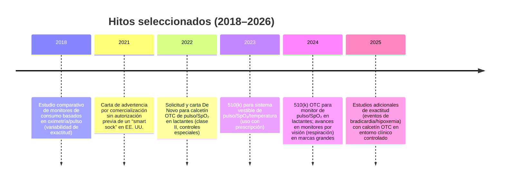
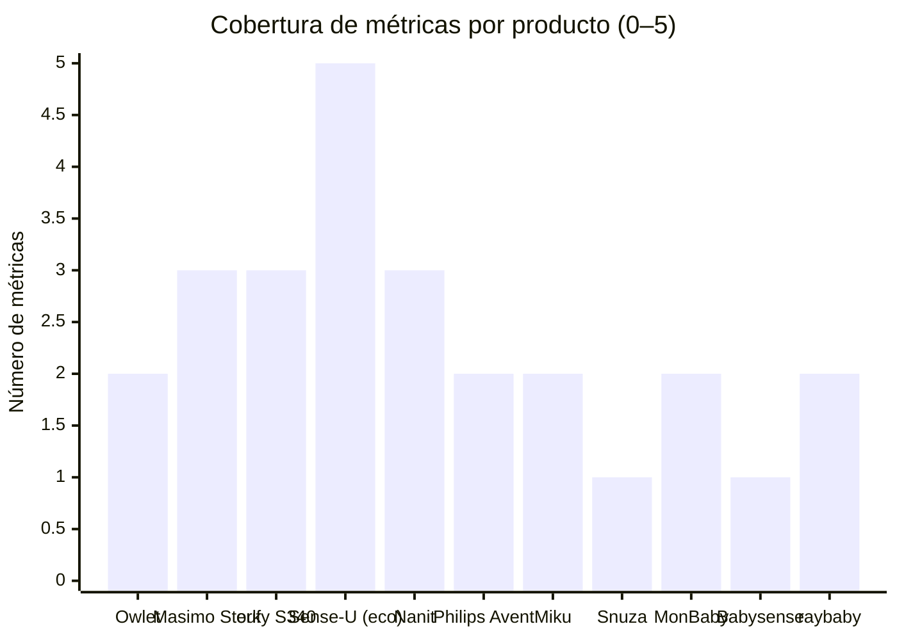

# Estado del arte de monitores de bebé que miden ritmo cardiaco y posición, y dispositivos afines de cuidado infantil

## Resumen ejecutivo

En el mercado global de los últimos ocho años, los monitores orientados a “bienestar y tranquilidad” se han consolidado principalmente en dos familias tecnológicas: (a) **vestibles** (calcetín/bota) basados en **fotopletismografía (PPG)** para estimar **frecuencia cardiaca (FC/pulso)** y usualmente **SpO₂**; y (b) **sin contacto** (cámara/visión por computadora o radar) para estimar **respiración** y, en algunos casos, **posición** (prono/supino/lateral) o “roll-over” (volteo). En la práctica, **muy pocos productos miden FC y posición con un único sensor**; lo más cercano suele ser un **ecosistema** (p. ej., calcetín PPG + cámara con analítica de postura) o la combinación de vestible + sensor de movimiento/posición. 

La **evidencia clínica publicada** específicamente sobre dispositivos de consumo ha sido históricamente **limitada y heterogénea**. Un estudio comparativo en **JAMA (2018)** evaluó dos monitores de consumo basados en oximetría/pulso y encontró resultados dispares: uno detectó hipoxemia con sensibilidad alta (reportada entre ~88.8% y 100% según el umbral) pero **no detectó adecuadamente bradicardia**, mientras que el otro mostró desempeño clínicamente preocupante. 

Desde 2022–2024 se observa un giro regulatorio importante: existen ya monitores “OTC” (de venta libre) con documentación pública en entity["organization","FDA","us food and drug admin"], como la **clasificación De Novo** de un calcetín PPG para lactantes y autorizaciones **510(k)** para sistemas con PPG (incluyendo especificaciones de desempeño, biocompatibilidad, seguridad eléctrica/EMC, software y ciberseguridad). Este cambio **no implica “prevención de SMSL”**, pero sí eleva el “piso” de evidencia exigida para ciertas afirmaciones y alarmas. 

En seguridad clínica, las guías pediátricas y de prevención de muerte súbita siguen enfatizando dos puntos: (1) **los monitores domiciliarios no han demostrado prevenir el síndrome de muerte súbita del lactante (SMSL/SIDS)**, y (2) pueden introducir **falsas alarmas**, ansiedad y decisiones clínicas inapropiadas si sustituyen la evaluación o las prácticas de sueño seguro. 

En privacidad y ciberseguridad, el panorama es desigual: muchos productos operan con **Wi‑Fi/app/nube**, lo que eleva el riesgo y la superficie de ataque. Hay casos donde la propia política declara limitaciones relevantes (por ejemplo, transmisión no cifrada del dispositivo a servidores en un monitor radar/cámara), mientras otros afirman cifrado fuerte o pruebas de ciberseguridad (en documentación regulatoria o marketing). El análisis debe, por tanto, ponderar no solo funciones, sino también **arquitectura de datos, prácticas de cifrado y ciclo de soporte**. 

## Criterios de búsqueda y alcance

El periodo de revisión asumido fue **febrero 2018–febrero 2026** (últimos 8 años), con alcance **global** y sin restricción de presupuesto (se reportan precios de referencia cuando están disponibles). Se priorizaron fuentes en **español** y **inglés**; cuando no hubo datos verificables, se indica explícitamente.

La búsqueda se enfocó en seis tipos de fuentes, tal como se solicitó:

1) **Sitios oficiales de fabricantes** (especificaciones técnicas, funciones, advertencias, políticas de privacidad y precios/“MSRP” cuando existen). 

2) **Normas y regulaciones**: documentación pública de autorización/clasificación (De Novo, 510(k)), marcos europeos (MDR), y referencias mexicanas regulatorias generales. 

3) **Artículos académicos originales** sobre precisión/validez (dispositivos concretos cuando existen) y sobre tecnologías subyacentes (PPG, visión, radar). 

4) **Revisiones de literatura** (p. ej., PPG vestible) y revisiones narrativas sobre monitores en neonatos/infantes.

5) **Pruebas de laboratorio / comparativas de expertos** (p. ej., pruebas instrumentadas de volumen de alarmas y observaciones de conectividad/fiabilidad).

6) **Reseñas de usuarios**: se usaron solo como señal de fallas/quejas recurrentes (no como evidencia de exactitud clínica).  

Limitación importante: algunos textos completos editoriales (p. ej., PDFs bloqueados) no estuvieron accesibles directamente; se recurrió a resúmenes indexados cuando fue necesario. 

## Panorama del mercado y taxonomía de dispositivos

La “función clínica aparente” (FC, SpO₂, respiración, postura) se logra con **sensores muy distintos**, por lo que conviene separar el problema en: **qué métrica se afirma** vs **qué sensor la puede sostener**.

### Relación entre tecnologías y métricas

```mermaid
flowchart LR
  PPG[PPG (fotopletismografía)] --> HR[Frecuencia cardiaca / pulso]
  PPG --> SPO2[SpO2]
  ECG[ECG (electrodos)] --> HR
  ACC[Acelerómetro / IMU] --> POS[Posición (prono/supino/lateral)]
  ACC --> MOV[Movimiento (actividad/“kick-off”)]
  PRESS[Presión / balistocardiografía / placa] --> RESP[Respiración (movimiento torácico/abdominal)]
  CAM[Cámara + visión por computadora] --> RESP
  CAM --> POS
  RAD[Radar (FMCW/UWB/mmWave)] --> RESP
  RAD --> MOV
  TH[Termistor / sensor temp] --> TEMP[Temperatura (piel o ambiente)]
```

Este mapeo refleja tanto documentación regulatoria (p. ej., “usa PPG para medir pulso y SpO₂”), como descripciones técnicas de fabricantes y literatura sobre medición sin contacto (cámara/radar). citeturn21view3turn22view0turn20search5turn39search11turn33search6turn4search2turn4search9

### Hitos recientes del “estado del arte”



Los hitos regulatorios y de evidencia se sustentan en documentos de entity["organization","FDA","us food and drug admin"] y publicaciones clínicas revisadas por pares. 

### Comparación rápida por cobertura de métricas

El siguiente gráfico compara cuántas métricas (de un conjunto simple: **FC, SpO₂, respiración, posición, temperatura**) cubre cada producto (según especificaciones públicas). **No** califica exactitud clínica; solo “cobertura funcional”. 



## Comparativa de productos relevantes

La tabla se centra en dispositivos que (i) miden **FC/pulso** (usualmente con SpO₂) y/o (ii) estiman **posición** y **respiración** con sensores vestibles o sin contacto, o (iii) son frecuentemente considerados como “alternativas” en la misma decisión de compra.

| Marca/modelo | Tipo de sensor | Métricas medidas | Método | Conectividad | Precisión reportada / validación pública | Certificaciones / estatus | Precio aproximado (referencia) | Pros / cons principales | Fuentes clave |
|---|---|---|---|---|---|---|---|---|---|
| entity["company","Owlet","baby monitor maker"] Dream Sock / Dream Duo | PPG (oximetría) + (en Duo) cámara + sensores ambientales | FC/pulso, SpO₂; (en Duo) audio/video, temp/humedad ambiente | Vestible (pie) + (opcional) cámara | Wi‑Fi + Bluetooth; app | De Novo define riesgos/controles (p. ej., desempeño clínico bajo condiciones previstas, pigmentación, señal PPG, alarmas, irritación). No se hallaron métricas numéricas “independientes” en la carta; existen reportes clínicos adicionales sobre sensores OTC tipo calcetín (ver evidencia). | De Novo OTC (clase II) para monitor de pulso/SpO₂; historial de carta de advertencia previa para “smart sock” sin autorización (2021) | USD $299.99 (Dream Sock); USD $379.99 (Duo, Gen 3) | **Pros:** ecosistema completo (en Duo), documentación regulatoria, alertas. **Contras:** no mide postura directamente; riesgo de sobreconfianza. |  |
| entity["company","Masimo","patient monitoring company"] Stork (Vitals/Vitals+) | PPG (SpO₂/PR) + termistor (temp) + (según bundle) cámara | SpO₂, pulso (PR), temperatura de piel (continua); video (según kit) | Vestible (pie) | Bluetooth + Wi‑Fi | 510(k) publica especificaciones: SpO₂ 1.5% (70–100%) en no-mov/mov; 2% baja perfusión; PR 3–5 bpm; temp ±0.3°C (según resumen). Incluye descripción de estudios clínicos (desaturación; comparación en neonatos/infantes; estudio nocturno en casa). | 510(k) (prescripción 2023) y 510(k) OTC (2024) para monitor infantil de pulso/SpO₂; nota: el propio sitio indica discontinuación de productos de consumo (incluido Stork) | USD $359.99 (Vitals+, referencia minorista; disponibilidad variable) | **Pros:** documentación técnica/ensayos en 510(k), métricas fisiológicas + temp. **Contras:** disponibilidad incierta por discontinuación; no mide postura. |  |
| entity["company","eufy","anker smart home brand"] Smart Sock S340 | PPG (según fabricante) + cámara; muestra temperatura | FC, SpO₂, sueño/movimiento; temperatura (display) | Vestible (pie) + cámara | Bluetooth + Wi‑Fi | Sin estudios clínicos revisados por pares encontrados. Pruebas comparativas de laboratorio reportan problemas posibles de conectividad/vitals (“mystery vitals”), sin calibración clínica publicada. | No se identificó estatus de dispositivo médico en fuentes consultadas | USD $279.99 (referencia minorista); también se listan precios/promos en tienda oficial | **Pros:** paquete todo‑en‑uno (cámara+calcetín), costo relativo menor, funciones amplias. **Contras:** evidencia pública limitada; dependencia de conectividad. |  |
| entity["company","Sense-U","smart baby monitor vendor"] Smart Sock Shoe O₂ + (ecosistema) monitor de movimiento/posición | PPG transmisiva (calcetín) + acelerometría (en abdominal/clip) | Calcetín: FC y SpO₂; Ecosistema: respiración por movimiento abdominal, posición/roll‑over, temperatura “feel” (según manual) | Vestible (pie) + vestible (abdomen/clip) | BLE; opción “long range” con base; app | Fabricante explica PPG transmisiva como “más estable” y declara NO ser dispositivo médico; no se hallaron métricas clínicas públicas. | Declarado “no medical device” por fabricante (calcetín) | Desde USD $149.99 (calcetín, promo); variante long‑range mayor | **Pros:** es de los pocos enfoques que cubre FC/SpO₂ + postura + respiración (combinando módulos). **Contras:** evidencia clínica pública limitada; más piezas = más fallas potenciales. |  |
| entity["company","Nanit","baby monitor company"] Smart Baby Monitor + Breathing Wear | Cámara + visión; “breathing wear” sin electrónica | Respiración por movimiento (“breathing motion”), posición (tile back/belly/side), temp/humedad ambiente, audio/video | Cámara (overhead) + textil con patrón | Wi‑Fi/app; funciones base sin suscripción (según fabricante) | En fuentes consultadas no se hallaron ensayos clínicos con métricas de error para respiración/posición del producto comercial; hay descripción técnica del patrón y su uso. | Se presenta como monitor “sensor‑free” (no médico) | Desde ~USD $289.99–$399 (según configuración/promos) | **Pros:** sin vestible electrónico; postura en app; temperatura/humedad. **Contras:** depende de instalación/ángulo; evidencia clínica cuantitativa pública limitada. |  |
| entity["company","Philips Avent","baby products brand"] Premium Connected Baby Monitor (SenseIQ) | Cámara + visión por computadora | Frecuencia respiratoria (por video), estado de sueño; temperatura ambiente (según línea “connected”) | Cámara | Unidad de padres + app; (según modelo) con/sin Wi‑Fi | Descripción técnica: “video tracking” de micro‑movimientos del pecho para respiración; no se hallaron métricas clínicas públicas de exactitud. | Se presenta como monitor conectado (no médico en FAQs, según línea de producto) | Sin MSRP claro en sitio consultado; precios varían por región/minorista | **Pros:** “wearable‑free”, unidad dedicada, enfoque en respiración. **Contras:** sin FC/SpO₂; validación cuantitativa pública no encontrada. |  |
| entity["company","Miku","baby monitor company"] Pro (SensorFusion) | Multisensor; fabricante menciona radar + óptico + audio + condiciones ambientales | Respiración sin contacto; movimiento; (según fabricante) condiciones del cuarto; audio/video | Cámara/radar (sin vestible) | Wi‑Fi/app; funciones avanzadas con membresía | No se hallaron publicaciones revisadas por pares con métricas de error del producto comercial; fabricante describe SensorFusion e indica que no es dispositivo médico. | Declarado no FDA‑approved medical device; certificaciones eléctricas/radio (FCC/CE/IC/RCM) según soporte | Membresía reportada: USD $9.99/mes (funciones premium) | **Pros:** sin vestible; enfoque en respiración. **Contras:** suscripción; evidencia clínica pública limitada; no FC/SpO₂. |  |
| entity["company","Snuza","baby breathing monitor maker"] Hero MD / Hero SE | Sensor de movimiento abdominal (contacto directo) | Respiración (por movimiento); alarmas/vibración | Vestible (clip al pañal) | Stand‑alone (sin app) | Fabricante afirma “clínicamente probado” y “dispositivo médico” (Europa) pero no se hallaron cifras públicas de sensibilidad/especificidad en fuentes consultadas; comparativas de laboratorio reportan volumen de alarma y facilidad. | Fabricante afirma dispositivo médico Clase IIb (marco europeo previo) | En México, SE ~MXN $2,800 (referencia); MD varía por país/minorista | **Pros:** simple, sin nube/app; alarmas locales. **Contras:** no FC; evidencia cuantitativa pública difícil de verificar; contexto regulatorio UE cambió (MDR). |  |
| entity["company","MonBaby","infant monitor company"] Advanced | Acelerómetro/clip (según categoría) | Respiración (alerta por no movimiento), posición al dormir (boca abajo), caídas (según fabricante) | Vestible (botón/clip en ropa) | App (según fabricante) | No se hallaron estudios clínicos revisados por pares del producto; funciones descritas por fabricante. | No se identificó estatus de dispositivo médico en fuentes consultadas | MXN ~$2,799 (referencia minorista) | **Pros:** postura (roll‑over) en vestible; costo moderado. **Contras:** respiración es proxy por movimiento; evidencia clínica pública limitada. |  |
| entity["company","raybaby","radar baby monitor brand"] (monitor radar/cámara) | Radar + IA + cámara (según fabricante) | Respiración; roll‑overs/posición (según fabricante); audio/video | Sin contacto (a distancia) | App/nube | Fabricante afirma exactitud (p. ej., “98%”) sin hallarse validación clínica revisada por pares en fuentes oficiales consultadas; política de privacidad declara transmisión no cifrada del dispositivo a servidores (riesgo relevante). | No se identificó estatus de dispositivo médico en fuentes consultadas | Precio no verificado en fuentes oficiales accesibles (varía por canal) | **Pros:** sin vestible; postura/roll‑over + respiración en una unidad. **Contras:** declaración explícita de no cifrado en tránsito (según política); evidencia clínica pública insuficiente. |  |
| entity["company","Babysense","baby breathing monitor brand"] 7 (placas bajo colchón) | Sensores bajo colchón (presión/movimiento) | Movimiento asociado a respiración (proxy) | Cama/colchón | Stand‑alone (típicamente) | No evaluado clínicamente en fuentes revisadas; comparativas de laboratorio lo ubican como “movement only”. | No determinado en fuentes consultadas | Precio no consolidado (varía por país/minorista) | **Pros:** sin vestible; instalación fija. **Contras:** solo proxy de respiración; susceptible a tipo de colchón/entorno. |  |

image_group{"layout":"carousel","aspect_ratio":"1:1","query":["Owlet Dream Sock baby monitor","Masimo Stork Vitals baby monitor","Nanit Pro baby monitor overhead camera","Snuza Hero MD baby breathing monitor"],"num_per_query":1}

## Evidencia sobre precisión, seguridad y limitaciones

La literatura y documentación pública permiten separar la evidencia en tres niveles: (i) **ensayos/revisiones clínicas con comparación contra referencia**, (ii) **documentación regulatoria pública** (De Novo/510(k)) con pruebas exigidas y, a veces, especificaciones; y (iii) **pruebas comparativas no médicas** (laboratorio de consumo) que suelen capturar usabilidad, conectividad y comportamiento de alarmas.

En cuanto a **exactitud clínica** en monitores de consumo basados en PPG (calcetín), el estudio de **Bonafide et al. (JAMA, 2018)** comparó dispositivos con un monitor de referencia autorizado y reportó que el desempeño puede variar ampliamente: para hipoxemia hubo un dispositivo con sensibilidad alta, pero **la detección de bradicardia fue deficiente**, y otro dispositivo mostró resultados clínicamente preocupantes (p. ej., fallas para detectar hipoxemia). Este trabajo se convirtió en referencia para el argumento de que “parecer oximetría” no equivale a “oximetría confiable” sin validación clínica robusta. 

Esa preocupación reaparece en estudios posteriores con métricas enfocadas en **eventos** (no solo lectura puntual). Un estudio prospectivo (2023, publicado después) evaluó la exactitud diagnóstica de un oxímetro OTC integrado a smartphone en una cohorte hospitalaria (prematuros y lactantes con riesgo de eventos), usando límites estrictos de bradicardia (HR <50 bpm) e hipoxemia (SpO₂ <80%) por ≥3 s. El estudio encontró **especificidad alta** (baja tasa de falsas alarmas), pero **sensibilidad baja para eventos breves**, mejorando cuando los eventos son más largos o con umbrales más altos. Esto es crucial: un dispositivo puede “alarmar poco” (especificidad alta) a costa de “perder eventos cortos” (sensibilidad baja), lo que cambia el tipo de riesgo (falsa tranquilidad vs falsa alarma). 

En el nivel regulatorio, la carta **De Novo** para calcetín OTC de pulso/SpO₂ es valiosa porque explicita **riesgos específicos** y controles: calidad de señal PPG (y fallas en detección), **falsos positivos/negativos**, irritación cutánea, y el riesgo de **malinterpretación y sobre‑dependencia** con retraso en buscar atención. También exige que el desempeño clínico se evalúe bajo condiciones de uso anticipadas e incluya variables como **pigmentación de piel**. 

Para un sistema con 510(k), el resumen público describe un paquete de validación más amplio: pruebas de biocompatibilidad (ISO 10993), seguridad eléctrica/EMC (IEC 60601‑1 / 60601‑1‑2), software (IEC 62304 y guías FDA), ciberseguridad, y estudios clínicos que incluyen desaturación controlada y comparación con oxímetros autorizados en neonatos/infantes, además de un estudio nocturno en casa para uso prolongado. El mismo documento publica especificaciones cuantitativas (p. ej., desempeño de SpO₂ en 70–100% bajo movimiento/no movimiento, y precisión de temperatura). 

En **pruebas independientes de laboratorio orientadas a consumo**, se observa otra clase de limitaciones: conectividad (alcance real por Bluetooth del vestible aunque la cámara sea Wi‑Fi), comportamiento de alarmas (dB medidos) y “lecturas fantasma” o discrepancias reportadas por usuarios. Estas pruebas no sustituyen ensayos clínicos, pero ayudan a predecir frustración operacional y riesgo de complacencia (p. ej., alarmas poco audibles) o ansiedad (p. ej., alertas repetidas / erráticas). 

Desde la perspectiva de seguridad del lactante y salud pública, las guías pediátricas siguen siendo consistentes: **no hay evidencia de que el uso rutinario de monitores domiciliarios prevenga el SMSL**, y su utilización puede generar preocupación y falsas alarmas; el enfoque con mejor respaldo para reducir riesgo continúa siendo el **sueño seguro** (supino, superficie firme, sin objetos blandos). 

## Consideraciones regulatorias y de privacidad

### Regulación y “qué significa” una certificación

En entity["country","Estados Unidos","country"], la frontera entre “bienestar” y “dispositivo médico” depende de **intención de uso** y afirmaciones. Un antecedente relevante es una **carta de advertencia** de la FDA por comercializar un calcetín monitor en EE. UU. sin autorización previa, lo que ilustra que el lenguaje de marketing y funciones (alarmas, rangos “seguros”, etc.) puede activar exigencias regulatorias. 

En la Unión Europea, el marco moderno es el **Reglamento (UE) 2017/745 (MDR)** para productos sanitarios, que redefine obligaciones y evaluación de conformidad. Para el consumidor, esto significa que “tiene CE” puede ser ambiguo: no todo CE implica certificación como producto sanitario (y, si lo es, importa la **clase** y el organismo notificado). El MDR es la referencia normativa primaria, y su transición ha afectado a fabricantes y portafolios. 

En entity["country","México","country"], el regulador sanitario entity["organization","COFEPRIS","mexico health regulator"] encuadra los dispositivos médicos para asegurar seguridad/eficacia; además existe un marco de normas (p. ej., sobre etiquetado, tecnovigilancia y buenas prácticas) que se vuelve más relevante si el producto se comercializa formalmente como “dispositivo médico” y no solo como electrónica de consumo. 

### Privacidad, datos biométricos y ciberseguridad

Los monitores modernos suelen recolectar un paquete de datos que puede incluir video/audio del dormitorio y datos fisiológicos/biométricos (p. ej., pulso, SpO₂, respiración estimada, postura). Según jurisdicción y modelo de negocio, aplican marcos como el **GDPR** en la UE (tratamiento de datos personales y, a menudo, datos de salud) y reglas como **COPPA** en EE. UU. para servicios en línea dirigidos a menores o que recolectan información de menores de 13 años (aunque muchos monitores se orientan a padres, la evaluación legal exacta depende de implementación y “dirección” del servicio). 

El riesgo práctico se concentra en tres puntos: (1) **tránsito y almacenamiento** (cifrado de extremo a extremo vs parcial), (2) **gestión de cuentas** (contraseñas, MFA, control de acceso multiusuario), y (3) **ciclo de soporte** (actualizaciones, vida útil, discontinuación). Como ejemplo de por qué se debe leer la política: un fabricante declara explícitamente que **no cifra** datos transmitidos desde el dispositivo a sus servidores o entre servidores y la app (aunque sí usa SSL para ciertos formularios), lo cual es una señal de riesgo para un producto que transmite datos del bebé. 

En contraste, documentación regulatoria 510(k) puede incluir secciones de **ciberseguridad** y pruebas asociadas, y algunos fabricantes declaran cifrado fuerte “anti‑hacking” como parte del posicionamiento del producto. La recomendación metodológica es no confiar en slogans: comprobar si existe (a) documentación regulatoria pública con requerimientos y (b) políticas de seguridad/privacidad coherentes con cifrado en tránsito y en reposo. 

Finalmente, un riesgo “nuevo” es la **discontinuación**: hay casos donde el propio fabricante indica que productos de consumo (incluyendo un monitor vestible) han sido descontinuados, lo que puede afectar disponibilidad de refacciones, servicio y continuidad de infraestructura en nube/app. Esto debe incorporarse explícitamente en decisiones de compra/implementación. 

## Recomendaciones de selección según necesidades

Para elegir con rigor, conviene partir de una regla operativa: **ningún monitor sustituye sueño seguro, vigilancia clínica ni evaluación médica**. Estos dispositivos pueden aportar señales, pero también pueden fallar o inducir sesgos cognitivos (sobre‑dependencia o ansiedad).

Para investigación clínica (o proyectos con supervisión médica), la primera criba debe ser **trazabilidad de desempeño**: elegir dispositivos con **documentación pública** (De Novo/510(k) con pruebas descritas y, si existe, especificaciones cuantitativas) y con posibilidad de captura/exportación de datos sin “caja negra”. En ese perfil encajan mejor los sistemas con resumen 510(k) público y/o clasificación De Novo con controles especiales, siempre validando soporte vigente y disponibilidad. 

Para uso doméstico en bebés sanos, la recomendación más conservadora es decidir primero **qué problema real se intenta resolver**: vigilancia de video/audio, ambiente (temperatura/humedad), o tranquilidad por vitals. Dado que la evidencia no respalda prevención de SMSL mediante monitores y sí documenta falsas alarmas/ansiedad, la prioridad debe ser **prácticas de sueño seguro** y seleccionar tecnología solo como complemento. 

Si el objetivo específico es **FC/SpO₂**, preferir dispositivos con respaldo regulatorio y comprender su “zona ciega”: la evidencia sugiere que, dependiendo de umbrales y filtrado, puede haber alta especificidad pero sensibilidad limitada para eventos muy breves; por ello, deben configurarse y usarse con expectativas realistas y, si hay condición médica, bajo guía profesional. 

Si el objetivo específico es **posición (prono/supino) y/o respiración**, distinguir entre (a) **proxy por movimiento** (clip/colchón) y (b) **estimación por cámara/radar**. En ambos, la recomendación es validar escenarios donde fallan: mantas/oclusiones, co‑sleeping, vibraciones externas, mascotas, múltiples personas, cambios de ángulo o iluminación. Para postura, los sistemas por visión pueden ofrecer “tiles” de posición, pero siguen siendo complementarios; la prevención primaria sigue siendo el sueño seguro y el retiro de swaddle cuando empieza el volteo. 

En privacidad, si hay Wi‑Fi/nube, incorporar como requisito mínimo: (1) cifrado en tránsito (idealmente, no solo en formularios), (2) control de acceso/multiusuario, (3) claridad de retención de video/datos, (4) historial de soporte/actualizaciones. Si la política declara transmisión no cifrada o reservas amplias para compartir datos agregados con terceros, considerarlo un “deal‑breaker” para datos del dormitorio del bebé. 

## Referencias prioritarias

**Regulación y guías clínicas (prioridad alta)**  
- Documento De Novo para monitor OTC infantil de pulso/SpO₂ (riesgos, controles especiales, PPG, uso previsto).   
- Resumen público 510(k) (K223721): especificaciones (SpO₂/PR/temp), pruebas (ISO/IEC), y descripción de estudios clínicos.   
- Registro 510(k) OTC para monitor infantil de pulso/SpO₂ (K234021) y anuncio de clearance OTC.   
- Guía de sueño seguro y postura de pediatría sobre monitores domiciliarios y SMSL (español e inglés).   
- Reglamento (UE) 2017/745 (MDR) como marco europeo primario para productos sanitarios.   
- Orientación mexicana general sobre autorización de dispositivos médicos y marco de NOM aplicables (COFEPRIS).   

**Evidencia académica clave (original y revisiones)**  
- Comparación clínica de monitores de consumo basados en oximetría/pulso (JAMA, 2018) y síntesis institucional del hallazgo.   
- Exactitud diagnóstica de oxímetro OTC tipo calcetín para eventos de bradicardia/hipoxemia (cohorte clínica; especificidad vs sensibilidad).   
- Revisión sobre PPG vestible (oportunidades y limitaciones; artefacto por movimiento, etc.). citeturn4search0  
- Radar para monitorización neonatal/infantil (contactless respiration) y cámara para signos/FC en neonatos como evidencia de factibilidad tecnológica (no necesariamente validación del producto comercial).   

**Pruebas independientes y señales de confiabilidad operativa**  
- Comparativa de laboratorio orientada a consumo (conectividad, volumen de alarmas, problemas de “vitals” en algunos sistemas).   

**Privacidad y protección de datos (marcos de referencia)**  
- GDPR (Reglamento (UE) 2016/679) como marco principal europeo de protección de datos personales.   
- COPPA (FTC) como marco de referencia en EE. UU. para privacidad infantil en servicios en línea.   
- Ejemplo de política de privacidad de monitor conectado con declaración explícita de transmisión no cifrada (para ilustrar por qué leer políticas). 