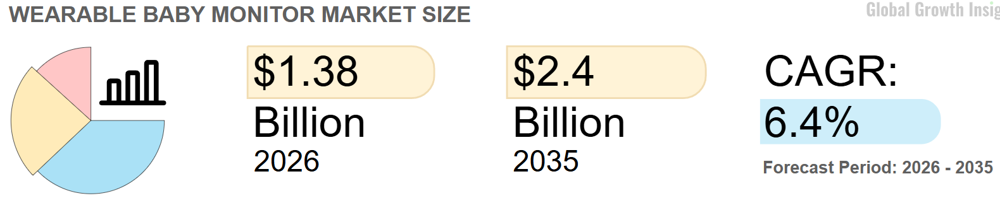
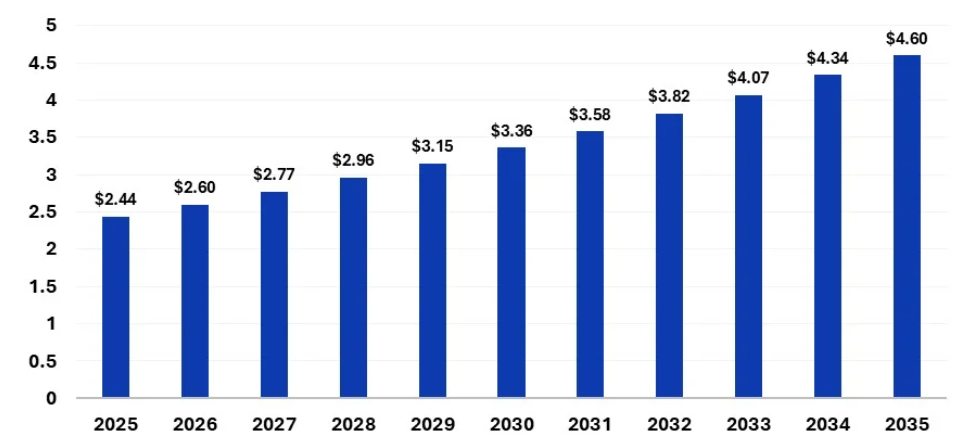
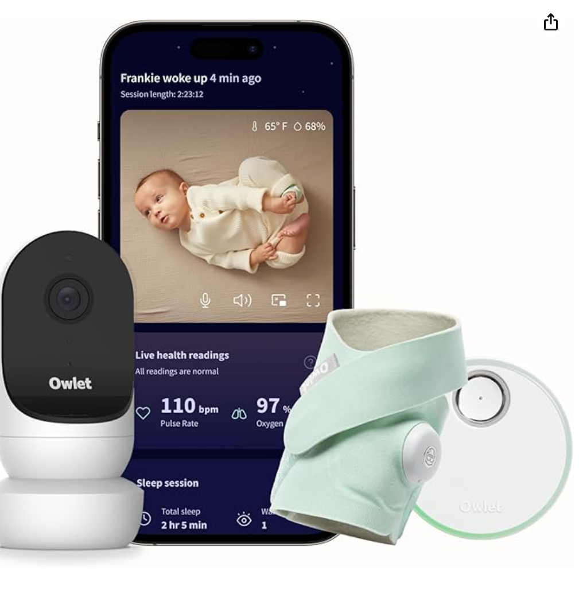
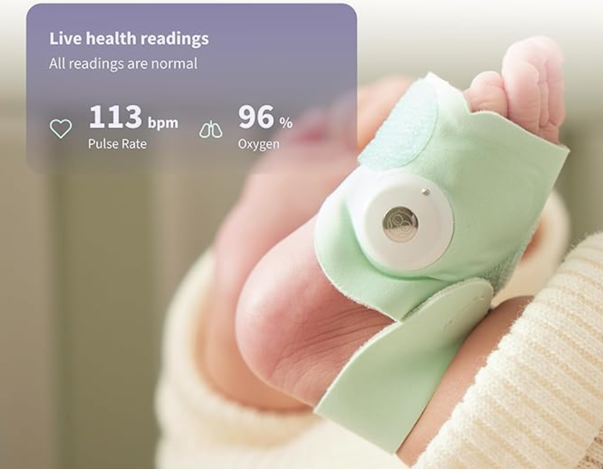
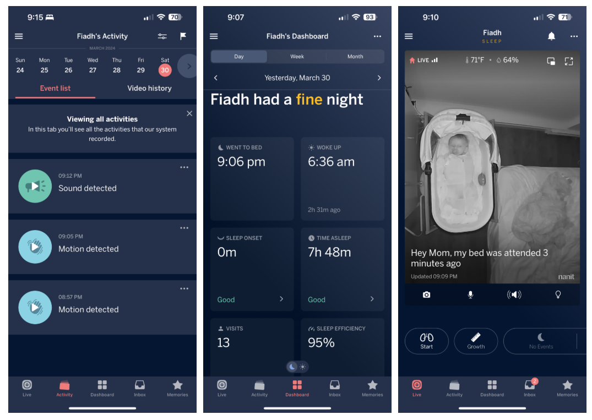
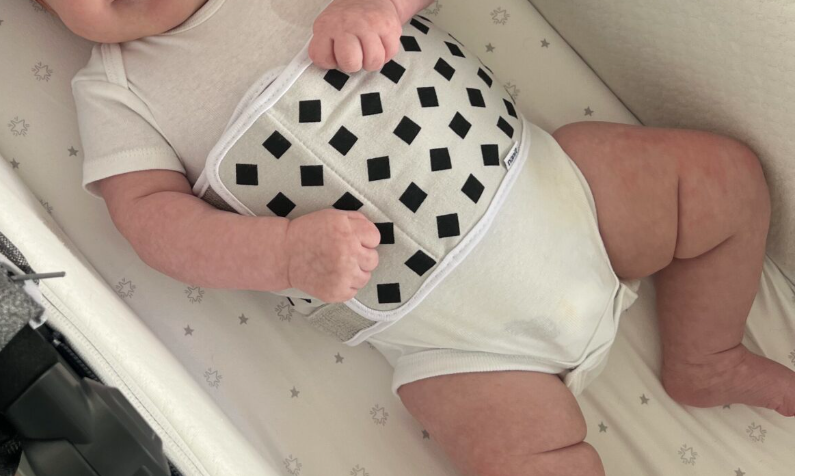
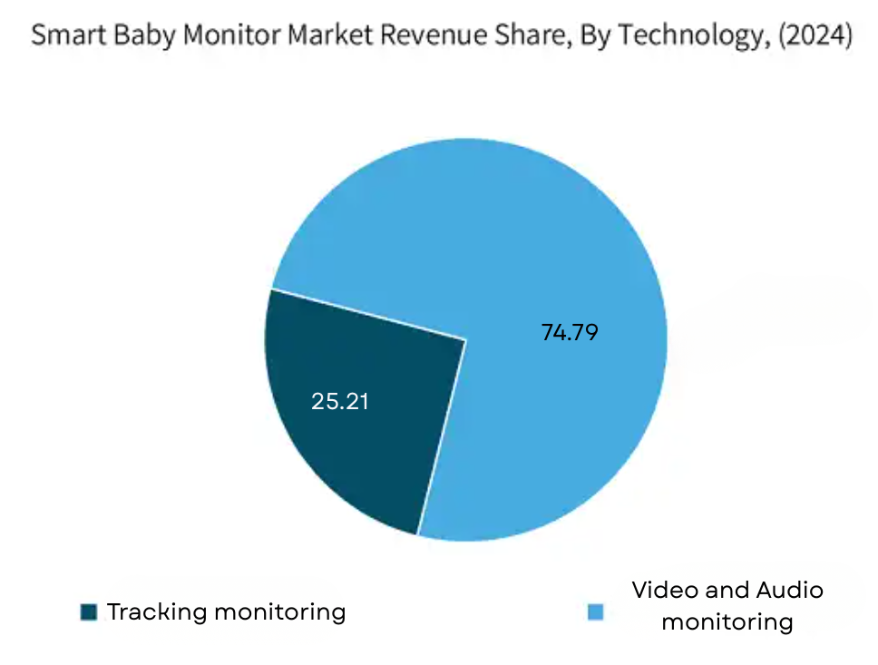
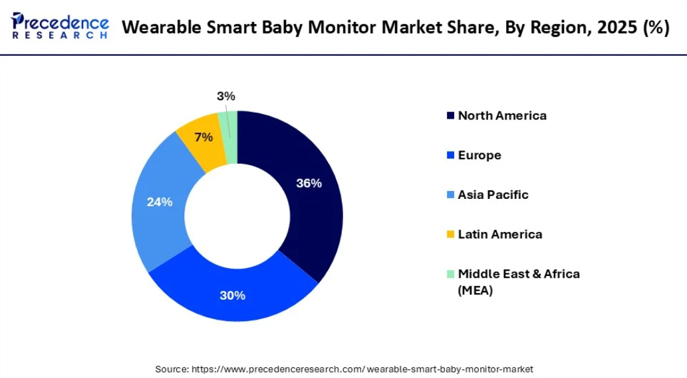

# Mercado de monitores de bebé

Se estimo que el tamaño del mercado global de monitores de bebes era de USD 2.4 mill millones en 2025 y se prevé que aumente a 2.6 mil millones a 2026 y a 4.6 mil millones para 2035.

El mercado de smart baby monitors en su totalidad fue estimado en USD $1.4 mil millones en 2024 y se espera que crezca a una CAGR del 10.3% entre 2025 y 2034, impulsado por la creciente demanda de monitoreo remoto.

*info en mil millones

## Descripción general del mercado

El mercado de monitores inteligentes para bebés portátiles está creciendo rápidamente debido a la creciente preocupación por la seguridad infantil, que surge con la adopción de tecnologías para hogares inteligentes, como los altavoces inteligentes.

Los sistemas inteligentes de monitorización para bebés monitorean el estado del bebé las 24 horas, los 7 días de la semana. Miden parámetros relacionados con la salud del bebé, como la frecuencia cardíaca y la temperatura corporal, que luego se pueden mostrar en la aplicación móvil , ofreciendo información valiosa sobre su desarrollo.

## El papel de la IA

La integración de la Inteligencia Artificial en los monitores portátiles para bebés mejora su funcionalidad. Ofrece tranquilidad a los padres, ya que pueden monitorear la salud de sus bebés en tiempo real, sin ser intrusivos. 

La IA ha demostrado ser una herramienta poderosa para el diagnóstico inteligente, la detección temprana y el bienestar a lo largo de la vida en el monitoreo del embarazo. Con un monitor avanzado que utiliza IA, es posible aprender los patrones de los bebés y enviar alertas a los padres. Además, la IA analiza los datos de los monitores, brindando información sobre los problemas de salud de los bebés y garantizando respuestas oportunas antes de que se agraven.

## Panorama competitivo 

 - Owlet: El Owlet Dream Sock monitorea signos vitales del bebé a través de un calcetín wearable con sensores avanzados que rastrean pulso y niveles de oxígeno. El precio del Dream Sock es de $239 USD. 

    
    

 - Nanit: Nanit detecta el movimiento respiratorio del bebé con una "Breathing Band", una banda de tela con un patrón especial que no tiene sensores ni electrónica, por lo que no requiere carga de batería. Los precios van de $249 a $399 USD según el soporte elegido.

    
    

 - Philips: Royal Philips lanzó el Philips Premium Connected Baby Monitor con tecnología patentada SenseIQ para rastreo de sueño y respiración sin wearables, y tecnología de traducción de llanto basada en IA

## Smart Monitor Market Companies

- Angel Care Monitor Incorporation
- Arlo Technologies, Inc.
- Baby Brezza
- Dorel Industries, Inc.
- Haier Group
- I Baby Labs
- Infant Optics
- Lorex Technology Inc
- Masimo’s
- Maxi-Cosi Inc.
- Net Gear Incorporation
- Owlet Baby Care
- Panasonic Corporation
- Philips
- Safety 1st
- Samsung Electronics Corporation

## Oportunidades de mercado

### Falsas alarmas y confiabilidad

El 29% de los consumidores han sido impactados por alertas falsas, un problema documentado incluso en las marcas líderes. Un dispositivo con mayor precisión en las alertas es una propuesta de valor directa y medible.

### Privacidad y seguridad de datos

Las brechas de seguridad pueden permitir que hackers accedan al video del bebé sin permiso. Existe preocupación sobre quién y con qué propósito usará los datos retenidos en la nube por algunos smart baby monitors. El 31% de los consumidores expresan preocupaciones sobre privacidad de datos. Un dispositivo con procesamiento local (edge computing, sin nube) tiene una ventaja diferenciadora importante.

### Asequibilidad

El 22% rechaza el producto por razones de asequibilidad. Los dispositivos premium de Owlet y Nanit rondan los $240–$400 USD, dejando un segmento de mercado completamente desatendido: padres que quieren monitoreo de signos vitales pero no pueden pagar esos precios.

### Batería y conectividad

Los problemas técnicos como problemas de conectividad WiFi, latencia y drenaje de batería son restricciones clave. La vida corta de la batería, especialmente en unidades para padres y wearables, es un punto de dolor que limita la portabilidad.

### Integración con ecosistemas de salud y hogar inteligente

La nueva ventaja competitiva descansa en funciones de inteligencia artificial que interpretan patrones de llanto, ritmos respiratorios y calidad del sueño. Los padres millennials demandan monitores compatibles con plataformas como Amazon Alexa y Google Home.

### Integración B2B: hospitales y guarderías

Expandirse más allá del uso residencial hacia guarderías de alta gama y hospitales también presenta nuevos dominios de aplicación. El 32% de los hospitales ya están integrando wearables para bebés. 

### Expansión en mercados emergentes e innovación tecnológica

Existe una gran oportunidad en regiones emergentes como Asia-Pacífico, Latinoamérica y Europa del Este, mercados con un uso creciente de internet y una clase media en expansión. Las plataformas de comercio electrónico permiten a los vendedores llegar a más padres directamente; la comparación de productos y las reseñas de los consumidores facilitan aún más las compras.

La innovación tecnológica también abre nuevos caminos: la integración de materiales ecológicos, sensores no invasivos, alertas predictivas basadas en IA, funciones de nanas y gestión remota mediante asistentes de voz. 

La expansión más allá del uso residencial hacia guarderías con servicios personalizados y hospitales también presenta nuevos ámbitos de aplicación. Los fabricantes que adapten formatos portátiles para uso multifuncional se beneficiarán de las ventajas de ser pioneros en mercados globales con baja penetración.

## Mercado en Latinoamerica

El mercado latinoamericano de dispositivos de monitoreo de bebés se proyecta que crezca de $1.2 mil millones en 2025 a aproximadamente $3.07 mil millones para 2033, con una CAGR del 12.4%. Brasil, México y Argentina son los mercados líderes, impulsados por el crecimiento de ingresos de la clase media y la urbanización.

América Latina muestra un prometedor potencial de crecimiento, liderado por Brasil y México. El creciente número de padres trabajadores y la creciente conciencia sobre la seguridad infantil impulsan la demanda del mercado.

En América Latina, hay un rápido crecimiento de la conectividad a internet y alta penetración de smartphones en la región, lo que permite a los padres usar aplicaciones para monitoreo. El crecimiento de familias nucleares y padres que trabajan ha aumentado la necesidad de soluciones de cuidado basadas en tecnología.

La ventaja de estar en México es enorme: las marcas dominantes (Owlet, Nanit) no tienen estrategia local específica para LATAM, sus precios están en dólares americanos, y el soporte técnico/servicio post-venta en español es prácticamente inexistente.

## Conclusiones

Para 2026, se estima que el mercado alcanzará un valor de 2.6 mil millones de dólares. De este total, aproximadamente el 7% corresponderá a Latinoamérica, y dentro de ese panorama, el 25.21% pertenece al segmento de dispositivos de tracking o monitoreo, categoría en la que se encuentra el dispositivo que se busca desarrollar. Con base en estas proporciones, se estima que el mercado accesible potencial sería de aproximadamente 45.9 millones de dólares. En este sentido, si se lograra captar tan solo el 1% de ese mercado accesible, se podría aspirar a ingresos aproximados de 459 mil dólares.

## Bibliografía 

[Precedence Research — Wearable Smart Baby Monitor Market (abril 2025): precedenceresearch.com](https://www.precedenceresearch.com/wearable-smart-baby-monitor-market)

[GM Insights — Smart Baby Monitor Market Size 2025–2034 (marzo 2025): gminsights.com](https://www.gminsights.com/industry-analysis/smart-baby-monitor-market)

[Mordor Intelligence — Baby Monitors Market (enero 2026): mordorintelligence.com](https://www.mordorintelligence.com/industry-reports/baby-monitors-market)

[Global Growth Insights — Wearable Baby Monitor Market 2033: globalgrowthinsights.com](https://www.globalgrowthinsights.com/market-reports/Swearable-baby-monitor-market-114989)

[Verified Market Reports — Latin America Baby Monitoring Devices Market 2033: verifiedmarketreports.com](https://www.verifiedmarketreports.com/frontier-insight/outlook/baby-monitoring-devices-market/latin-america/)

[IMARC Group — Smart Baby Monitor Market 2025–2033: imarcgroup.com](https://www.imarcgroup.com/smart-baby-monitor-market)

[Coherent Market Insights — Video Baby Monitors Market 2025–2032: coherentmarketinsights.com](https://www.coherentmarketinsights.com/market-insight/video-baby-monitors-market-6195)

[Allied Market Research — Baby Monitor Market Forecast 2034: alliedmarketresearch.com](https://www.alliedmarketresearch.com/baby-monitor-market)

